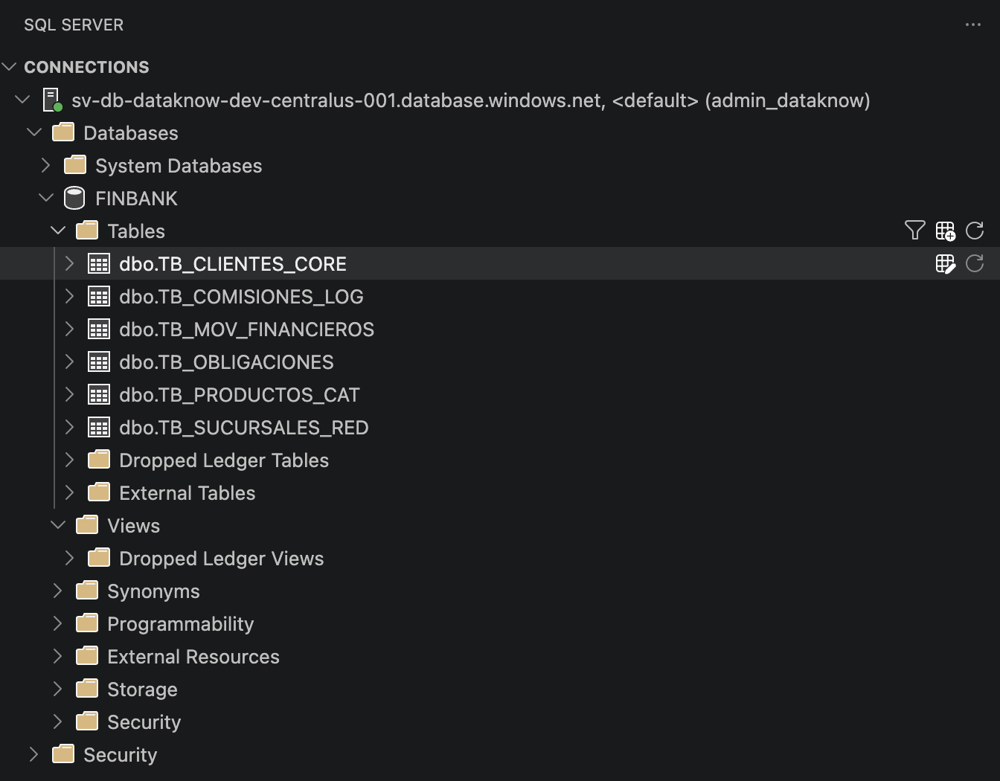
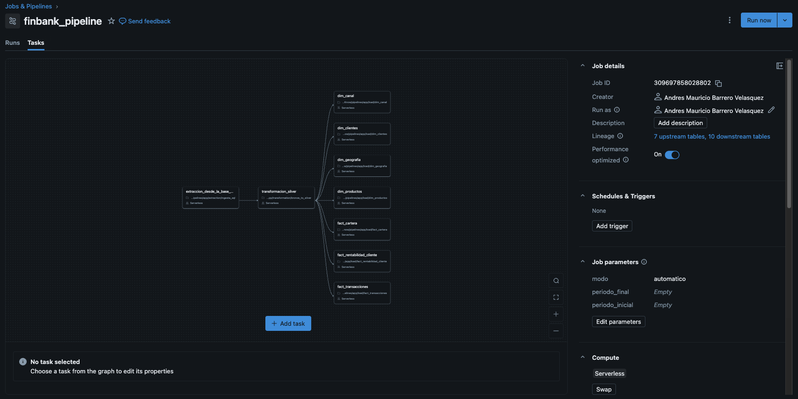
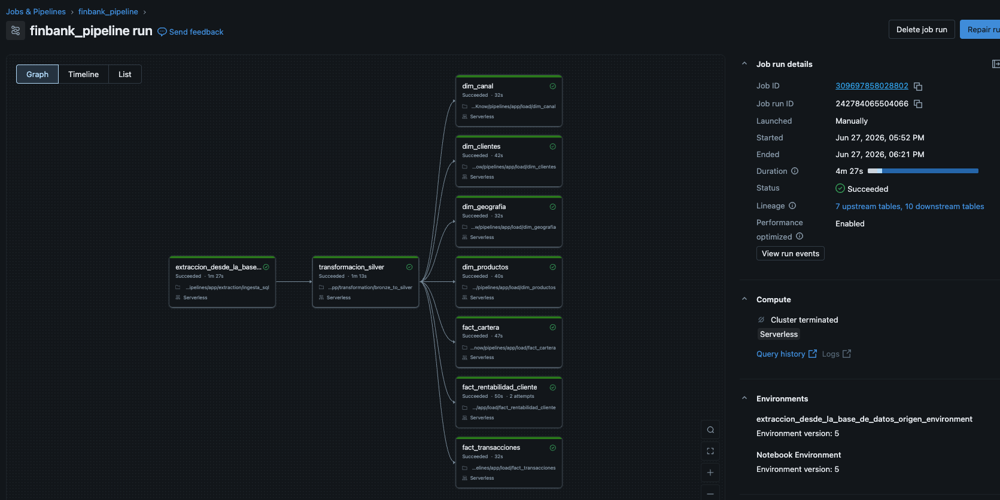
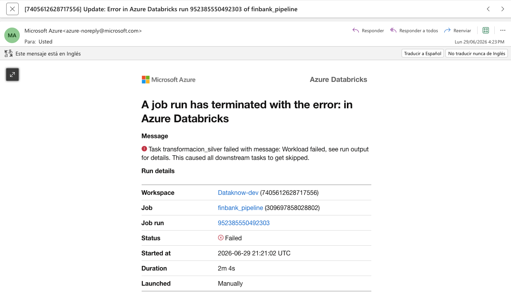
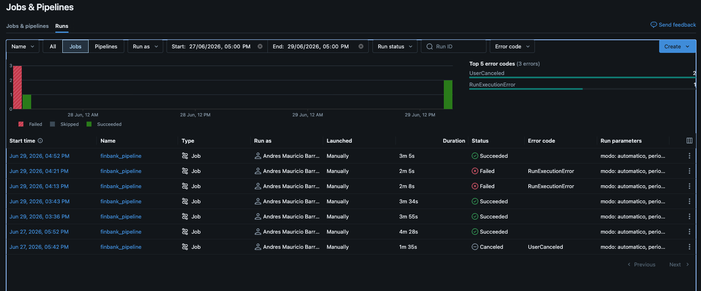
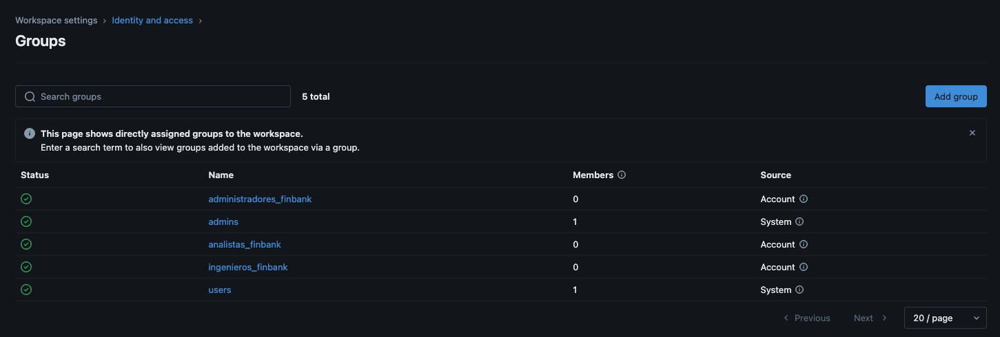
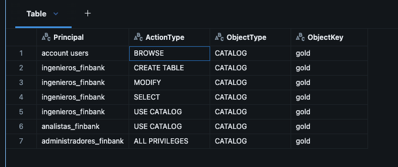

<!-- ===================== -->
<!--        PORTADA        -->
<!-- ===================== -->

# Prueba Técnica – Ingeniería de Datos Dataknow


> Agradecimientos: Muchas gracias a los evaluadores por dedicar tiempo a revisar este proyecto.

**Autor:** Andres Mauricio Barrero Velásquez  
**Correo:** andresvlasquez@gmail.com 
**Fecha:** 29/06/2026  
**Github de este repositorio** https://github.com/ambarrerov/ChallengeDataKnow
**Linkeln** www.linkedin.com/in/juan-camilo-barrero-velasquez-engineer

---
Tabla de contenido

Escenario FinBank
Motivación de la selección del escenario
Fase 1 – Generación de datos y modelo relacional
Generación de datos
Carga de datos a Azure SQL
Archivo de configuración
Modelo entidad-relación
Resultado del proceso de carga

---

# Escenario Finbank

FinBank S.A. es un banco digital fundado en 2015 con presencia en cinco países de Latinoamérica: Colombia, Mexico, Peru, Chile y Argentina. Opera exclusivamente a través de canales digitales, aplicación móvil, portal web y una red de corresponsales bancarios, y cuenta con más de dos millones de clientes activos. Su cartera de crédito supera los USD 800 millones y el banco procesa en promedio 1.2 millones de transacciones diarias entre pagos, transferencias, recargas y avances. 
    
El modelo de negocio se basa en tres líneas de producto: crédito de consumo (créditos de libre inversión, crédito rotativo y tarjeta digital), cuentas de ahorro digitales y servicios transaccionales como pagos PSE, transferencias ACH y corresponsalía.
    
La base de clientes está segmentada internamente en cuatro categorías: Básico, Estándar, Premium y Elite. 
    
El equipo de Riesgo Crediticio monitorea diariamente el comportamiento de la cartera y calcula las provisiones regulatorias exigidas por la Superintendencia Financiera. Actualmente trabaja con reportes manuales en Excel construidos cada mañana durante aproximadamente dos horas a partir de múltiples fuentes desconectadas, lo que genera inconsistencias, retrasos y riesgo operativo.
    
Por otra parte, el área de Prevención de Fraude opera mediante reglas manuales que requieren ser enriquecidas con señales históricas del comportamiento del cliente. 
    
La necesidad principal consiste en desarrollar un pipeline que consolide toda esta información para que ambas áreas puedan consumir datos confiables y actualizados sin depender de procesos manuales.

## Motivacion de seleccion de escenarion y carga en base de datos relacional

De los cuatro sectores propuestos decidí trabajar el escenario de Banca y Servicios Financieros, ya que es un dominio que considero especialmente interesante y cuyos conceptos me resultan familiares. Además, me pareció el escenario más desafiante para demostrar habilidades relacionadas con Ingeniería de Datos.

Como motor de base de datos relacional elegí Azure SQL Database, debido a que me encuentro familiarizado con el ecosistema de Microsoft Azure y cuento con la certificación Microsoft Azure Fundamentals (AZ-900). Esto permitió desarrollar una arquitectura similar a la que podría encontrarse en un entorno empresarial. 

## FASE 1 — GENERACION DE DATOS Y MODELO RELACIONAL

La primera fase del proyecto consistió en construir una fuente de datos ficticia que representara la operación de FinBank.

Para ello se tomó como guía el modelo de datos sugerido por el escenario de la prueba y se desarrollaron scripts en Python que generan información sintética utilizando la librería `Faker` de python.

La generación de los datos fue asistida por IA como apoyo para modelar escenarios propios del dominio bancario y producir información consistente. Toda la arquitectura del proyecto, el diseño del modelo relacional, la configuración del entorno, la integración con Azure SQL Database, la implementación del proceso de carga mediante Apache Spark y `JDBC`, así como la organización general del pipeline


<!-- ENTREGABLES FASE 1
• Script de generación de datos dummy con semilla aleatoria fija y parámetros
configurables
• Script SQL o Python de carga en la base de datos relacional seleccionada
• Diagrama Entidad-Relación (ER) de todas las tablas generadas, ubicado en la
carpeta /docs del repositorio
• Evidencia de la carga exitosa: captura de pantalla o resultado de SELECT
COUNT(*) por tabla -->


### Script de generacion de datos dummy

nota: el script de generacion esta dentro del notebook `datagen.pyibn`

Uno de los principales retos de esta prueba fue construir un conjunto de datos suficientemente representativo para desarrollar el resto del proyecto.

Debido a que modelar todos los posibles eventos de un negocio bancario requiere un conocimiento funcional amplio, se utilizó inteligencia artificial como apoyo para construir los generadores de datos sintéticos, los cuales posteriormente fueron ajustados para satisfacer las necesidades del proyecto.

Las siguientes funciones generan los seis conjuntos de datos utilizados durante toda la prueba:

```python
def generar_sucursales():
    ...

def generar_productos():
    ...

def generar_clientes():
    ...

def generar_obligaciones():
    ...

def generar_batch_movimientos():
    ...

def generar_comisiones():
    ...
```

### cargue de datos a base sql

Una vez generados los datos, estos fueron cargados hacia Azure SQL Database utilizando Apache Spark mediante el controlador `JDBC`.

Para evitar exponer credenciales dentro del código, la configuración de conexión fue externalizada mediante un archivo `config.json`, mientras que las credenciales fueron almacenadas como secretos en `Azure Key Vault`, permitiendo una administración más segura de la información sensible.

La función encargada de realizar el proceso de escritura es la siguiente:

```python

def write_jdbc(df_spark, table, mode="overwrite"):
    full = f"{SCHEMA_SQL}.{table}"
    cnt  = df_spark.count()
    print(f"  ⏳ {full} — {cnt:,} registros ...")
    (df_spark.write.format("jdbc")
        .option("url",      JDBC_URL)
        .option("dbtable",  full)
        .option("user",     JDBC_PROPS["user"])
        .option("password", JDBC_PROPS["password"])
        .option("driver",   JDBC_PROPS["driver"])
        .option("batchsize", 10_000)
        .option("numPartitions", 8)
        .mode(mode)
        .save())
    print(f"  ✅ {full} cargada")

```

#### configuracion de el script de geneacion de datos:

Todos los parámetros relacionados con la generación de datos y la conexión a la base de datos fueron centralizados en el archivo con ruta `/config/config.json`

Este archivo permite modificar el comportamiento del proceso sin necesidad de alterar el código fuente e incluye:

    -configuración del Azure Key Vault;
    -nombres de los secretos utilizados para la conexión;
    -cantidad de registros por tabla;
    -países simulados;
    -porcentaje de valores nulos;
    -semilla aleatoria;
    -esquema de la base de datos;
    -parámetros para la generación de anomalías.

```json
    {
    "key_vault": {
        "scope": "finbank-kv-scope",
        "keys": {
        "host":     "finbank-sql-host",
        "port":     "finbank-sql-port",
        "db":       "finbank-sql-db",
        "user":     "finbank-sql-user",
        "password": "finbank-sql-password"
        }
    },
    "data_config": {
        "TB_CLIENTES_CORE":   10000,
        "TB_PRODUCTOS_CAT":      50,
        "TB_MOV_FINANCIEROS": 500000,
        "TB_OBLIGACIONES":     30000,
        "TB_SUCURSALES_RED":     200,
        "TB_COMISIONES_LOG":   80000,
        "historico_meses":        12,
        "paises":   ["Colombia", "Mexico", "Peru", "Chile", "Argentina"],
        "null_rate":            0.05,
        "random_seed":            42,
        "schema":              "dbo",
        "anomalias": {
        "duplicados_mov":        500,
        "fechas_fuera_rango":    200,
        "montos_inconsistentes": 150
        }
    }
    }
```

### Representacion grafica ER de las tablas generadas


El modelo implementado sigue una arquitectura similar a un esquema en estrella, conformado por tres tablas de dimensiones y tres tablas de hechos.

Las tablas de dimensiones:

* `TB_CLIENTES_CORE`  
* `TB_PRODUCTOS_CAT`  
* `TB_SUCURSALES_RED`  

representan la información maestra del negocio, siendo el cliente la entidad central del modelo.

Las tablas de hechos registran los principales eventos operacionales del banco:

* `TB_OBLIGACIONES` almacena la cartera de créditos, relacionando clientes y productos.
* `TB_MOV_FINANCIEROS` constituye la tabla de mayor volumen (500.000 registros), registrando cada transacción realizada y relacionándola con el cliente, el producto y la sucursal donde fue originada.
* `TB_COMISIONES_LOG` registra las comisiones generadas por las transacciones financieras, relacionando cada comisión con el cliente y con el movimiento que la originó.

nota: para más detalle: data-generation/README.md

### Demostracion de la ejecucion de cargue de datos:



```bash
=======================================================
📋 VALIDACIÓN FINAL — [REDACTED] Mockup
=======================================================
  ✅ TB_SUCURSALES_RED                200 registros
  ✅ TB_PRODUCTOS_CAT                  50 registros
  ✅ TB_CLIENTES_CORE              10,000 registros
  ✅ TB_OBLIGACIONES               30,000 registros
  ✅ TB_MOV_FINANCIEROS           500,500 registros
  ✅ TB_COMISIONES_LOG             80,000 registros
  ──────────────────────────────────────────────────
  TOTAL                        620,750 registros
=======================================================
```

    nota: Tomado de el output de `validar_tabla()`

Con esta primera fase se obtuvo una fuente de datos relacional completamente funcional, desplegada sobre Azure SQL Database, que servirá como base para las siguientes etapas del proyecto: procesamiento, calidad de datos, modelado analítico y explotación de la información mediante Apache Spark.


## FASE 3 — PIPELINE END TO END FLUJO DE DATOS: ARQUITECTURA MEDALLION

Para esta fase es necesario tener claro los objetivos en cada una de las capas (Bronze, Silver y Gold) para una optima transformación de los datos.

<!-- ENTREGABLES FASE 3
• Código completo de las tres capas del pipeline en la carpeta /pipelines del
repositorio
• Tabla de errores del pipeline con al menos un registro de prueba que demuestre su
funcionamiento
• Reporte de calidad de datos generado por la capa Silver con métricas de al menos
una ejecución
• Al menos tres tablas o vistas de agregación en la capa Gold con sus definiciones
documentadas
• Resultados de las cinco pruebas de calidad de datos con el reporte de aprobación
o fallo -->

### Codigo completo de las tres capas 

En la capa Bronze los datos llegan en crudo, con el mínimo de transformaciones. Es importante que los datos no sufran mayores cambios en esata capa para permitir la reproducción de cualquier estado anterior del pipeline.


#### Inicialización del entorno

En el notebook `pipelines/app/extraction/ingesta_sql` Primero se importan todas las librerías necesarias para la ejecución del Pipieline y luego se defiinen dos variables 

CONFIG_PATH corresponde a la ubicación del archivo de configuración utilizado durante la ejecución del proyecto.

BRONCE_PATH define el contenedor del Azure Data Lake Storage Gen2 donde se almacenan los datos extraídos desde la base de datos relacional. Toda la información es escrita en formato `Parquet`, constituyendo la capa Bronze de la arquitectura Medallion implementada para el proyecto.

```python
CONFIG_PATH = "../config/config.json"
BRONCE_PATH = "abfss://bronze@stdataknowdeveastus001.dfs.core.windows.net/"
```

se establecen `widgets` para automatizar procesos con parámetros de entrada al momento de ejecutarse, se establecen dos modos para ejecutar. el modo Automático, que procesa únicamente el período actual y el modo Histórico que permite reprocesar información de un rango de meses, itera sobre todos los meses comprendidos en ese intervalo para recalcular o recargar información histórica.

```python
modo = dbutils.widgets.get("modo")
periodo_final = dbutils.widgets.get("periodo_final")
periodo_inicial = dbutils.widgets.get("periodo_inicial")
```

Para evitar almacenar credenciales directamente en el código fuente se configura de forma segura la conexión entre Apache Spark (Databricks) y Azure SQL Database la configuración se obtiene desde un archivo `JSON` json.load() y las credenciales se recuperan de Azure Key Vault mediante Databricks Secrets.

```python
with open(CONFIG_PATH) as f:
    cfg = json.load(f)
 
SCOPE       = cfg["key_vault"]["scope"]
KV_KEYS     = cfg["key_vault"]["keys"]

# Leer secretos desde Azure Key Vault (kv-dataknow-dev-eastus)
host     = dbutils.secrets.get(SCOPE, KV_KEYS["host"])
port     = dbutils.secrets.get(SCOPE, KV_KEYS["port"])
db       = dbutils.secrets.get(SCOPE, KV_KEYS["db"])
user     = dbutils.secrets.get(SCOPE, KV_KEYS["user"])
password = dbutils.secrets.get(SCOPE, KV_KEYS["password"])

driver   = "com.microsoft.sqlserver.jdbc.SQLServerDriver"
 
JDBC_URL = (
    f"jdbc:sqlserver://{host}:{port};"
    f"databaseName={db};"
    f"encrypt=true;"
    f"trustServerCertificate=false;"
)
JDBC_PROPS = {
    "user":     user,
    "password": password,
    "driver":   "com.microsoft.sqlserver.jdbc.SQLServerDriver",
}
```

#### Extracción de datos hacia la capa Bronze

Este proceso se dividió en dos estrategias, esta separación permite reducir el volumen de datos transferidos durante las ejecuciones periódicas y optimiza el tiempo de procesamiento del pipeline.

Las tablas dimensionales `TB_CLIENTES_CORE, TB_PRODUCTOS_CAT y TB_SUCURSALES_RED` se procesan mediante carga completa, ya que presentan pocos cambios y su volumen es reducido.

Mientras que las tablas de hechos `TB_COMISIONES_LOG, TB_MOV_FINANCIEROS y TB_OBLIGACIONES` se procesan mediante carga incremental, indicando además la columna de fecha utilizada para filtrar la información correspondiente a cada período.

```python
tb_full = [
    "TB_CLIENTES_CORE",
    "TB_PRODUCTOS_CAT",
    "TB_SUCURSALES_RED"
]

tb_incremental = {
    "TB_COMISIONES_LOG" : "fec_cobro",
    "TB_MOV_FINANCIEROS" : "fec_mov",
    "TB_OBLIGACIONES" : "fec_desembolso"
}
```

La función `extract_full()` realiza la extracción completa de las tablas dimensionales.

Para cada tabla se ejecutan las siguientes actividades:

Se establece la conexión hacia Azure SQL Database mediante JDBC.
Se lee la totalidad de los registros utilizando Apache Spark.
Se agregan columnas de auditoría:  
`_fecha_extraccion`: registra el momento en que se realizó la extracción.  
`_fuente`: identifica la tabla de origen.  
Finalmente, la información se almacena en la capa Bronze del Data Lake en formato Parquet, reemplazando completamente la versión anterior.

```python
def extract_full(list_tb):
    for i in list_tb:
        df = spark.read.format("jdbc") \
            .option("url",      JDBC_URL) \
            .option("dbtable",  "dbo."+i) \
            .option("user",     user) \
            .option("password", password) \
            .option("driver",   driver) \
            .load()

        df = df \
            .withColumn("_fecha_extraccion", F.current_timestamp()) \
            .withColumn("_fuente", F.lit(i))

        df.write.mode("overwrite").format("parquet").save(BRONCE_PATH + i)

extract_full(tb_full)
```

Para soportar la carga histórica se implementó la función `generar_periodos()`, la cual construye una lista de meses comprendidos entre un período inicial y un período final, esta lista es utilizada posteriormente por el proceso de extracción incremental para recorrer cada período de manera automática.

```python
def generar_periodos(periodo_ini, periodo_fin):
    fmt = "%m-%Y"
    start = datetime.strptime(periodo_ini, fmt)
    end   = datetime.strptime(periodo_fin, fmt)
    periodos = []
    current = start
    while current <= end:
        periodos.append(current.strftime(fmt))
        current += relativedelta(months=1)
    return periodos
```

La función `extract_incremental()` implementa la extracción de información transaccional mediante filtros por fecha y soporta los dos modos de operación mencionados antes Automático e Histórico.

Como resultado de esta fase, la información queda organizada en formato Parquet, esta organización permite mantener separadas las cargas históricas y las cargas incrementales o periódicas, facilitando la trazabilidad, el reprocesamiento y la implementación de arquitecturas tipo Medallion, donde la capa Bronze representa una copia fiel de la información proveniente de los sistemas fuente.

#### Transformación de datos de Bronze a Silver

en el notebook `pipelines/app/transformation/bronze_to_silver` se realiza todo el proceso de transformación.

Una vez extraída la información hacia la capa **Bronze**, se implementó una etapa de transformación encargada de aplicar reglas básicas de calidad de datos, estandarización y protección de **información sensible**.

Con el objetivo de favorecer la reutilización del código, todas estas validaciones fueron centralizadas en la función `transformar()`, la cual recibe como entrada un `DataFrame` de Spark y el nombre de la tabla procesada.


### Reglas de calidad implementadas

Durante la transformación se aplican las siguientes validaciones de manera secuencial.

#### 1. Eliminación de registros duplicados

En primer lugar se eliminan los registros completamente duplicados mediante la función:

```python
df.dropDuplicates()
```

Con ello se garantiza que únicamente permanezcan registros únicos dentro del conjunto de datos.

#### 2. Detección de nulos

Posteriormente se identifica cualquier registro que contenga valores nulos `null` en las columnas de la tabla.

Los registros que incumplen esta regla no son descartados definitivamente; en cambio, son enviados a un **DataFrame de errores**, incorporando información adicional para facilitar su auditoría:

* motivo del rechazo;
* tabla de origen;
* fecha y hora del rechazo.

Mientras tanto, únicamente los registros conformes continúan el flujo de transformación.

#### 3. Estandarización de tipos

Con el fin de homogenizar la información proveniente del sistema fuente, se aplican reglas de normalización sobre los datos.

todas las columnas de tipo string reciben `trim` y `upper` para normalizar espacios y mayúsculas. Las columnas cuyo nombre contiene "fecha" o "date" se castean a `DateType` con el formato dd-MM-yyyy que viene de Bronze.

#### 4. Protección de datos personales (PII)

Después de estandarizar la información, se identifican las columnas catalogadas como **PII (Personally Identifiable Information)**.

Cada una de estas columnas es reemplazada por su correspondiente valor cifrado mediante SHA-256, evitando que la información sensible permanezca visible dentro del Data Lake.

Esta estrategia permite cumplir principios básicos de privacidad sin afectar la posibilidad de realizar procesos de trazabilidad o cruces entre registros.

Como parte de las buenas prácticas de seguridad, se implementó una **User Defined Function (UDF)** que utiliza el algoritmo criptográfico **SHA-256** para anonimizar los campos considerados como información personal identificable (PII) y permite conservar la unicidad de los valores sin almacenar la información original, protegiendo datos sensibles como nombres y documentos de identidad.

```python
hash_udf = F.udf(
    lambda v: hashlib.sha256(str(v).encode()).hexdigest() if v is not None else None,
    StringType()
)
```

#### 5. Generación del reporte de calidad

Finalmente, el proceso calcula diferentes indicadores de calidad para cada tabla procesada.

Entre las métricas generadas se encuentran:

* número de registros originales;
* cantidad de registros rechazados;
* cantidad de registros conformes;
* porcentaje de conformidad;
* porcentaje de valores nulos por cada columna.

Esta información es presentada en consola durante la ejecución del pipeline y permite monitorear rápidamente la calidad de los datos extraídos desde la fuente transaccional.

## Carga de la capa Silver (Tablas de carga completa)

Una vez finalizada la extracción hacia la capa **Bronze**, se ejecuta el proceso de carga de las tablas maestras hacia la capa **Silver**.

La función `cargue_full()` recorre cada una de las tablas definidas para carga completa y aplica el proceso de transformación descrito anteriormente, obteniendo dos conjuntos de datos:

* **Registros conformes**, que cumplen las reglas de calidad establecidas.
* **Registros rechazados**, que presentan inconsistencias y son enviados a una zona de errores para su posterior análisis.

### Lectura desde Bronze

Para cada tabla se realiza la lectura de los archivos almacenados en formato **Parquet** dentro de la capa Bronze.

Esta capa conserva una copia prácticamente fiel de la información proveniente del sistema fuente y constituye el punto de partida para las transformaciones posteriores.

### Aplicación de reglas de calidad

Posteriormente se invoca la función `transformar()`, responsable de ejecutar las validaciones implementadas durante la fase de transformación, entre ellas:

* eliminación de registros duplicados;
* validación de campos obligatorios;
* estandarización de formatos;
* conversión de tipos de datos;
* anonimización de información sensible mediante SHA-256;
* generación de métricas de calidad.

Como resultado, la función devuelve dos DataFrames independientes: uno con información conforme y otro con los registros rechazados.

### Registro de tablas en el Metastore

Finalmente, cada conjunto de datos es registrado como una tabla administrada mediante la instrucción:

```sql
CREATE TABLE IF NOT EXISTS silver.cleaned.<tabla>
USING DELTA
LOCATION '<ruta>'
```

De esta forma, las tablas quedan disponibles para ser consultadas directamente mediante **Spark SQL**, sin necesidad de acceder manualmente a los archivos almacenados en el Data Lake.

## Carga de la capa Silver (Tablas de carga incremental)

Las tablas transaccionales presentan un crecimiento continuo, por lo que reemplazar completamente su contenido en cada ejecución resultaría ineficiente. Para estos casos se implementó un proceso de carga incremental que procesa únicamente la información correspondiente al período solicitado.

Esta estrategia reduce el volumen de datos procesados, disminuye los tiempos de ejecución y facilita el reprocesamiento de períodos específicos sin afectar el resto de la información almacenada.

### Identificación de períodos a procesar

El pipeline soporta dos modos de ejecución:

* **Modo automático:** procesa únicamente el período correspondiente a la fecha actual.
* **Modo histórico:** procesa un rango de períodos definido por el usuario.

La función `get_periodos()` determina automáticamente qué meses deben ser procesados, mientras que `generar_periodos()` construye la secuencia de meses cuando se ejecuta una carga histórica.

### Validación de archivos disponibles

Antes de iniciar la lectura, el proceso verifica que existan archivos Parquet para el período solicitado dentro de la capa Bronze.

Esta validación evita fallos durante la ejecución y permite omitir automáticamente aquellos períodos para los cuales no existe información.

En caso de no encontrar archivos, el pipeline registra un mensaje informativo y continúa con el siguiente período sin interrumpir la ejecución.

### Transformación y control de calidad

Para cada período disponible se invoca la función `transformar()`, la cual aplica las reglas de calidad implementadas durante la fase anterior:

* eliminación de registros duplicados;
* validación de campos obligatorios;
* estandarización de texto;
* conversión de tipos de datos;
* anonimización de información sensible mediante SHA-256.

Adicionalmente, durante esta etapa se incorpora una nueva columna denominada **`periodo`**, utilizada posteriormente como criterio de particionamiento dentro de la capa Silver.

Esta columna permite identificar fácilmente el período al que pertenece cada conjunto de registros y optimiza las consultas sobre información histórica.

### Gestión de registros rechazados

Los registros que no cumplen las reglas de calidad son almacenados en una ubicación independiente utilizando formato **Delta Lake** y modo **Append**, preservando el historial completo de errores generados durante las distintas ejecuciones del pipeline.

Esta estrategia facilita la auditoría de la calidad de los datos sin afectar los procesos analíticos que consumen únicamente información conforme.

### Actualización incremental de la capa Silver

El proceso verifica inicialmente si la tabla Delta ya existe.

* **Si la tabla no existe**, se crea por primera vez escribiendo la información en formato Delta y particionándola por la columna `periodo`.

* **Si la tabla ya existe**, únicamente se reemplaza la información correspondiente al período que está siendo reprocesado.

Para ello se ejecuta previamente una sentencia:

```sql
DELETE FROM delta.`<ruta_silver>`
WHERE periodo = '<periodo>'
```

Posteriormente se insertan los nuevos registros mediante una operación **Append**.

Este enfoque evita duplicados durante los reprocesamientos y garantiza que cada período tenga una única versión vigente dentro de la capa Silver.

### Particionamiento de la información

Las tablas transaccionales son almacenadas utilizando la columna **`periodo`** como criterio de particionamiento.

Esta estrategia ofrece varias ventajas:

* reduce el volumen de datos leído durante las consultas;
* mejora el rendimiento de los procesos analíticos;
* simplifica el reprocesamiento de meses específicos;
* facilita la administración del ciclo de vida de los datos.


### Registro en el catálogo de Databricks

Durante la primera ejecución, el pipeline registra automáticamente cada tabla Delta dentro del metastore de Databricks mediante la instrucción `CREATE TABLE IF NOT EXISTS`.

De esta manera, las tablas quedan disponibles para consultas mediante Spark SQL, facilitando su utilización en procesos posteriores de integración, modelado analítico y construcción de la capa Gold.

#### Transformación de datos de Silver a Gold

Esta fase toma los datos ya limpios y transformados de la capa *Silver* y los materializa en la capa *Gold* como tablas Delta analíticas organizadas en un modelo dimensional. Cada notebook sigue el mismo patrón: crear la vista temporal con la lógica de negocio, crear la tabla destino si no existe, y ejecutar el `DELETE` + `INSERT` o el ciclo de periodos según el tipo de carga.

#### Dimensiones "Carga full"

Las tres dimensiones se reemplazan completas en cada ejecución porque son catálogos maestros que no tienen historial por periodo.

* *dim_clientes* : construye la vista tvw_dim_clientes desde silver.cleaned.tb_clientes_core. Renombra los campos a nombres de negocio, concatena nombre y apellido en NOMBRE_COMPLETO y calcula la edad con MONTHS_BETWEEN. La escritura hace DELETE total seguido de `INSERT`, reemplazando el contenido completo de la tabla.

* *dim_productos* : construye tvw_dim_productos desde silver.cleaned.tb_productos_cat. Calcula la `TASA_MENSUAL_EQUIVALENTE` a partir de la tasa EA (efectiva anual) y clasifica cada producto en su `FAMILIA_PRODUCTO` (CREDITO, AHORRO o TRANSACCIONAL) según el tipo de producto. Misma estrategia de escritura `DELETE` + `INSERT`.

* *dim_canal* : construye `tvw_dim_canal` desde `silver.cleaned.tb_sucursales_red`. Clasifica cada punto de atención en su canal digital (APP MOVIL, PORTAL WEB, CORRESPONSAL BANCARIO). `DELETE` + `INSERT` completo.

#### Tablas de hechos "Carga incremental por periodo"

Las tres facts manejan dos modos controlados por `widgets` de Databricks: `automatico` procesa solo el periodo del mes en curso, e `historico` itera sobre un rango de periodos definido por `periodo_inicial` y `periodo_final`.

En ambos modos el patrón es crear la vista temporal con la lógica, hacer `DELETE WHERE PERIODO = X` sobre la tabla destino, e `INSERT` desde la vista. Esto permite reprocesar un periodo sin afectar los demás.

* *fact_transacciones* fuente: `silver.cleaned.tb_mov_financieros`. Calcula el `MONTO_USD` dividiendo por la TRM de referencia, clasifica el `FLAG_HORARIO` como HABIL o NO HABIL según día de semana y hora, y calcula el `PROMEDIO_MOVIL_30D` y `FLAG_ANOMALIA` usando una ventana de 30 días por cliente. Valida que el cliente exista en `dim_clientes` mediante `INNER JOIN`.

* *fact_cartera* fuente: `silver.cleaned.tb_obligaciones`. Clasifica cada obligación en su `BUCKET_MORA` (AL DIA, RANGO 1, RANGO 2, RANGO 3, DETERIORADO) y su `CLASIFICACION_REGULATORIA` (A/B/C/D/E) según días de mora. Calcula la `PROVISION_ESTIMADA` aplicando los porcentajes mínimos regulatorios de la Superintendencia financiera sobre el saldo de capital.

* *fact_rentabilidad_cliente* fuentes: `silver.cleaned.tb_mov_financieros` y `silver.cleaned.tb_comisiones_log`. Agrega intereses y comisiones por cliente y periodo con un `FULL OUTER JOIN`para no perder registros que existan en solo una de las dos fuentes. Calcula el `INGRESO_TOTAL` y el `CLTV_12M` como la suma acumulada de los últimos 12 periodos usando una ventana `ROWS BETWEEN 11 PRECEDING AND CURRENT ROW`.

## FASE 4 — ORQUESTACION DEL PIPELINE

<!-- ENTREGABLES FASE 4
• Definición del DAG o pipeline principal en la carpeta /orchestration del repositorio
• Captura de pantalla del DAG ejecutado exitosamente con el estado de cada tarea
visible
• Evidencia de la alerta de fallo: captura del correo o mensaje recibido ante una
ejecución fallida de prueba
• Evidencia del reporte diario de éxito: captura del correo o mensaje de resumen
recibido
• Acceso al dashboard o log de monitoreo con el historial de al menos dos
ejecuciones-->

#### Definición del DAG o pipeline principal

Para la Fase 4 de la prueba se pide una representación visual de un flujo de trabajo del DAG:


`/Workspace/Users/andres_anbu@hotmail.com/ChallengeDataKnow/orchestration/finbank_pipeline.yml`



Después de correr el Job esta fue la captura de pantalla:



La evidencia de la alerta de fallo, se programó para que se envíe un correo asociado a la cuenta de Azure:

```python
...
modo = dbutils.widgets.get("test_fallo") #test_fallo : "modo"
periodo_final = dbutils.widgets.get("periodo_final")
periodo_inicial = dbutils.widgets.get("periodo_inicial")   
...
```

Para generar el fallo se cambió una parte del código para forzar un error sencillo.



``` 
...
      name: finbank_pipeline
      email_notifications:
        on_success:
          - andres_anbu@hotmail.com
        on_failure:
          - andres_anbu@hotmail.com
...

```

Evidencia del reporte diario, en el `YAML` se configuró una ejecución programada automática diaria a las 02:00 horas del huso horario local del proyecto.

```
...
          - andres_anbu@hotmail.com
      schedule:
        quartz_cron_expression: "0 0 2 * * ?"   # todos los dias a las 2:00am
        timezone_id: America/Bogota
        pause_status: UNPAUSED
      tasks:
...
```

Acceso al dashboard o log de monitoreo con el historial de al menos dos
ejecuciones



## FASE 5 — GOBIERNO, SEGURIDAD Y CALIDAD


<!-- ENTREGABLES FASE 5
• Definición de los tres roles implementados con evidencia de la configuración en la
plataforma
• Demostración del acceso denegado: evidencia de que el perfil Analista no puede
acceder a las capas Bronze o Silver directamente
• Catálogo de datos básico en formato Markdown ubicado en la carpeta /docs del
repositorio
• Evidencia del funcionamiento de las tres alertas: fallo, reporte diario y anomalías
de volumen
• CHANGELOG.md con el historial de cambios del proyecto durante el desarrollo de
la prueba-->


Para la fase 5 se definen e implementan al menos tres roles diferenciados: Ingeniero de Datos con permisos de lectura y escritura en todas las capas, Analista con acceso de solo lectura a la capa Gold, y Administrador con control total sobre los recursos del proyecto.



Demostración del acceso denegado



Catalogo de datos enformato Markdown.

`docs/catalogo_datos.md`