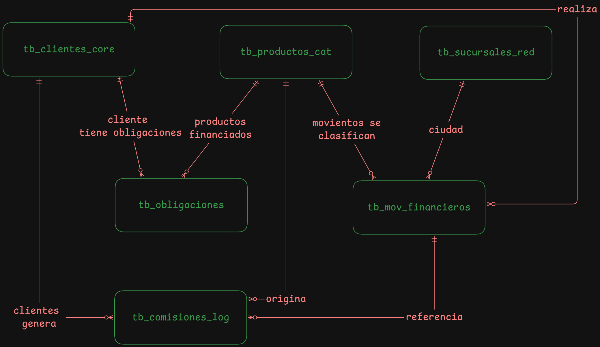
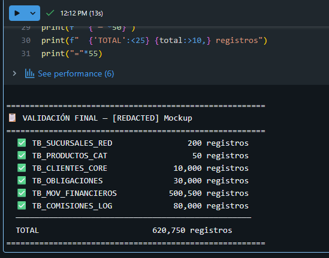

# FinBank S.A. — Generador de Datos Mockup

Pipeline de generación de datos sintéticos para **FinBank S.A.**, banco digital con presencia en 5 países de Latinoamérica. Genera datos realistas para 6 tablas, los carga en **SQL Server** vía **Spark JDBC** y ejecuta validaciones de integridad automáticas.

---

## Modelo Entidad–Relación

El modelo sigue una arquitectura estrella con tres dimensiones y tres tablas de hechos.
Dimensiones (`TB_CLIENTES_CORE`, `TB_PRODUCTOS_CAT`, `TB_SUCURSALES_RED`) actúan como maestros de referencia. El cliente es la entidad central del modelo — todo parte de él.
Tablas de hechos registran los eventos del negocio:

-`TB_OBLIGACIONES` captura la cartera de créditos, vinculando cliente y producto.

-`TB_MOV_FINANCIEROS` es la tabla más voluminosa (500K registros), registra cada transacción y se relaciona con cliente, producto y ciudad de la sucursal.

-`TB_COMISIONES_LOG` cierra el ciclo de ingresos, referenciando tanto al cliente como al movimiento que originó la comisión.


### Relaciones

| Desde | Hacia | Cardinalidad | Descripción |
|---|---|---|---|
| `TB_CLIENTES_CORE` | `TB_MOV_FINANCIEROS` | 1 : N | Un cliente realiza muchas transacciones |
| `TB_CLIENTES_CORE` | `TB_OBLIGACIONES` | 1 : N | Un cliente tiene muchas obligaciones |
| `TB_CLIENTES_CORE` | `TB_COMISIONES_LOG` | 1 : N | Un cliente genera muchas comisiones |
| `TB_PRODUCTOS_CAT` | `TB_OBLIGACIONES` | 1 : N | Un producto financia muchas obligaciones |
| `TB_PRODUCTOS_CAT` | `TB_MOV_FINANCIEROS` | 1 : N | Un producto clasifica muchos movimientos |
| `TB_SUCURSALES_RED` | `TB_MOV_FINANCIEROS` | 1 : N | Una ciudad tiene muchos movimientos |
| `TB_MOV_FINANCIEROS` | `TB_COMISIONES_LOG` | 1 : N | Un movimiento origina comisiones |
| `TB_COMISIONES_LOG` | `TB_MOV_FINANCIEROS` | N : 1 | Una comisión referencia un movimiento |

---

## Tablas generadas

| Tabla | Tipo | Volumen | Descripción |
|---|---|---|---|
| `TB_SUCURSALES_RED` | Dimensión | 200 | Red de puntos físicos y digitales |
| `TB_PRODUCTOS_CAT` | Catálogo | 50 | Catálogo de productos financieros |
| `TB_CLIENTES_CORE` | Dimensión | 10.000 | Maestro de clientes FinBank |
| `TB_OBLIGACIONES` | Hechos | 30.000 | Cartera de créditos activa e histórica |
| `TB_MOV_FINANCIEROS` | Hechos | 500.000 | Transacciones (pagos, transferencias…) |
| `TB_COMISIONES_LOG` | Hechos | 80.000 | Log de comisiones cobradas por cliente |

---

## Características de los datos

### Distribuciones realistas

| Campo | Distribución |
|---|---|
| Edad clientes | Normal (μ=38, σ=12), rango 18–80 |
| Montos transacciones | Log-normal por tipo de movimiento |
| Horarios | Picos 9–11 AM y 14–16 PM |
| Estacionalidad | Volúmenes altos en diciembre, marzo y agosto |
| Segmentación clientes | Básico 45 %, Estándar 35 %, Premium 15 %, Elite 5 % |
| Score buró | Correlacionado al segmento (Básico 400–600, Elite 750–850) |
| Días de mora | Exponencial; 85 % de cartera en 0 días mora |

### Montos por tipo de transacción

| Tipo | Distribución (log-normal) | Media aprox. USD |
|---|---|---|
| PAGO | μ=4.5, σ=1.2 | ~90 |
| TRANSFERENCIA | μ=5.0, σ=1.3 | ~150 |
| RECARGA | μ=3.8, σ=0.8 | ~45 |
| AVANCE | μ=5.5, σ=1.0 | ~245 |
| RETIRO | μ=4.8, σ=0.9 | ~120 |
| DEPOSITO | μ=5.2, σ=1.1 | ~180 |

### Valores nulos controlados (~5 %)
Campos no críticos con nulos intencionales: `depto_res`, `sdo_interes`, `cod_ciudad`, `id_dispositivo`, `id_mov_ref`, `pais` (en comisiones y obligaciones).

### Cobertura temporal
12 meses hacia atrás desde la fecha de ejecución, con distribución estacional.

---

## Anomalías intencionales

Tres patrones de datos anómalos inyectados para validar el pipeline de calidad de datos:

| # | Anomalía | Tabla | Volumen | Condición |
|---|---|---|---|---|
| 1 | `sdo_capital > vr_aprobado` | `TB_OBLIGACIONES` | 150 registros | Saldo supera el monto aprobado |
| 2 | Fechas año 2099 | `TB_MOV_FINANCIEROS` | 200 registros | `fec_mov` con año = 2099 |
| 3 | Transacciones duplicadas | `TB_MOV_FINANCIEROS` | 500 registros | Registros con `id_mov` repetido |

---

## Configuración

### config/config.json

```json
{
  "key_vault": {
    "scope": "finbank-kv-scope",
    "keys": {
      "host":     "finbank-sql-host",
      "port":     "finbank-sql-port",
      "db":       "finbank-sql-db",
      "user":     "finbank-sql-user",
      "password": "finbank-sql-password"
    }
  },
  "data_config": {
    "TB_CLIENTES_CORE":   10000,
    "TB_PRODUCTOS_CAT":      50,
    "TB_MOV_FINANCIEROS": 500000,
    "TB_OBLIGACIONES":     30000,
    "TB_SUCURSALES_RED":     200,
    "TB_COMISIONES_LOG":   80000,
    "historico_meses":        12,
    "paises": ["Colombia", "Mexico", "Peru", "Chile", "Argentina"],
    "null_rate":            0.05,
    "random_seed":            42,
    "schema":              "dbo",
    "anomalias": {
      "duplicados_mov":        500,
      "fechas_fuera_rango":    200,
      "montos_inconsistentes": 150
    }
  }
}
```

El notebook lee los **nombres de los secretos** desde el JSON y los valores reales los obtiene del **Azure Key Vault** `kv-dataknow-dev-eastus` vía Databricks Secret Scope:

```
config.json  →  nombres de keys
      ↓
dbutils.secrets.get(scope, key)
      ↓
Azure Key Vault (kv-dataknow-dev-eastus)
      ↓
host / port / db / user / password
```

### Secretos requeridos en Azure Key Vault

| Nombre en KV | Descripción |
|---|---|
| `finbank-sql-host` | Hostname SQL Server |
| `finbank-sql-port` | Puerto (1433) |
| `finbank-sql-db` | Base de datos (`FinBank`) |
| `finbank-sql-user` | Usuario SQL |
| `finbank-sql-password` | Contraseña SQL |

---

## Output de ejecución exitosa

### Generación de tablas

```
✅ Config cargada → sv-db-dataknow-dev-centralus-001.database.windows.net / FinBank
   Rango : 2025-06-27 → 2026-06-27

🏦 Generando TB_SUCURSALES_RED ...
  ⏳ dbo.TB_SUCURSALES_RED — 200 registros ...
  ✅ dbo.TB_SUCURSALES_RED cargada

📦 Generando TB_PRODUCTOS_CAT ...
  ⏳ dbo.TB_PRODUCTOS_CAT — 50 registros ...
  ✅ dbo.TB_PRODUCTOS_CAT cargada

👥 Generando TB_CLIENTES_CORE ...
  ⏳ dbo.TB_CLIENTES_CORE — 10,000 registros ...
  ✅ dbo.TB_CLIENTES_CORE cargada

💳 Generando TB_OBLIGACIONES ...
  ⚠️  Anomalía 1: 150 registros sdo_capital > vr_aprobado
  ⏳ dbo.TB_OBLIGACIONES — 30,000 registros ...
  ✅ dbo.TB_OBLIGACIONES cargada

💸 Generando TB_MOV_FINANCIEROS ...
  ⚠️  Anomalía 2: 200 fechas año 2099 inyectadas
  📊 Batch 1/10 completado
  📊 Batch 2/10 completado
  ...
  📊 Batch 10/10 completado
  ⚠️  Anomalía 3: insertando 500 duplicados ...
  ✅ dbo.TB_MOV_FINANCIEROS cargada

💰 Generando TB_COMISIONES_LOG ...
  ⏳ dbo.TB_COMISIONES_LOG — 80,000 registros ...
  ✅ dbo.TB_COMISIONES_LOG cargada
```
#### Evidencia de Output
```python
    def validar_tabla(tabla, expected_min):
        try:
            df = (spark.read.format("jdbc")
                .option("url",      JDBC_URL)
                .option("dbtable",  f"{SCHEMA_SQL}.{tabla}")
                .option("user",     JDBC_PROPS["user"])
                .option("password", JDBC_PROPS["password"])
                .option("driver",   JDBC_PROPS["driver"])
                .load())
            cnt = df.count()
            status = "✅" if cnt >= expected_min else "⚠️"
            print(f"  {status} {tabla:<25} {cnt:>10,} registros")
            return cnt
        except Exception as e:
            print(f"  ❌ {tabla:<25} Error: {e}")
            return 0

    print("\n" + "="*55)
    print("📋 VALIDACIÓN FINAL — FinBank Mockup")
    print("="*55)

    total = 0
    total += validar_tabla("TB_SUCURSALES_RED",  DATA_CONFIG["TB_SUCURSALES_RED"])
    total += validar_tabla("TB_PRODUCTOS_CAT",   DATA_CONFIG["TB_PRODUCTOS_CAT"])
    total += validar_tabla("TB_CLIENTES_CORE",   DATA_CONFIG["TB_CLIENTES_CORE"])
    total += validar_tabla("TB_OBLIGACIONES",    DATA_CONFIG["TB_OBLIGACIONES"])
    total += validar_tabla("TB_MOV_FINANCIEROS", DATA_CONFIG["TB_MOV_FINANCIEROS"])
    total += validar_tabla("TB_COMISIONES_LOG",  DATA_CONFIG["TB_COMISIONES_LOG"])
    print(f"  {'─'*50}")
    print(f"  {'TOTAL':<25} {total:>10,} registros")
    print("="*55)

```



### Validación de integridad referencial

```
🔍 Validaciones de integridad referencial:
  ✅ Movimientos sin cliente válido  : 0 huérfanos
  ✅ Obligaciones sin cliente válido : 0 huérfanos
  ✅ Comisiones sin cliente válido   : 0 huérfanos
```

### Validación de anomalías

```
⚠️  Validación de anomalías documentadas:
  ✅ Anomalía 1 — sdo_capital > vr_aprobado : 150 encontrados (esperado ≥ 150)
  ✅ Anomalía 2 — fechas año 2099            : 200 encontrados (esperado ≥ 200)
  ✅ Anomalía 3 — id_mov duplicados          : 500 encontrados (esperado ≥ 500)

🟢 Pipeline finalizado exitosamente
```

---

## Reglas de negocio soportadas

| # | Regla | Tablas involucradas |
|---|---|---|
| 1 | Indicador diario de mora por cliente, producto y región | `TB_OBLIGACIONES` + `TB_CLIENTES_CORE` + `TB_PRODUCTOS_CAT` |
| 2 | Detección de transacciones atípicas para motor de fraude | `TB_MOV_FINANCIEROS` (vr_mov, tip_mov, cod_canal, hra_mov) |
| 3 | Customer Lifetime Value mensual | `TB_COMISIONES_LOG` + `TB_OBLIGACIONES` |
| 4 | Reportes regulatorios (cuentas activas, volúmenes por canal y ciudad) | `TB_MOV_FINANCIEROS` + `TB_PRODUCTOS_CAT` + `TB_SUCURSALES_RED` |
| 5 | Vista 360° del cliente para equipo comercial | Todas las tablas |

---

## Queries de validación adicionales

```sql
-- Distribución de segmentos (esperado ~45/35/15/5 %)
SELECT cod_segmento,
       COUNT(*) AS total,
       ROUND(COUNT(*) * 100.0 / SUM(COUNT(*)) OVER(), 1) AS pct
FROM dbo.TB_CLIENTES_CORE
GROUP BY cod_segmento ORDER BY total DESC;

-- Nulos en campo no crítico (esperado ~5 %)
SELECT ROUND(SUM(CASE WHEN depto_res IS NULL THEN 1.0 ELSE 0 END)
       / COUNT(*) * 100, 2) AS pct_nulos
FROM dbo.TB_CLIENTES_CORE;

-- Distribución por hora (picos esperados 9-11 AM y 14-16 PM)
SELECT DATEPART(HOUR, CAST(hra_mov AS TIME)) AS hora, COUNT(*) AS total
FROM dbo.TB_MOV_FINANCIEROS
GROUP BY DATEPART(HOUR, CAST(hra_mov AS TIME))
ORDER BY hora;

-- Mora por región (regla de negocio #1)
SELECT o.pais, o.ciudad, p.tip_prod,
       AVG(o.dias_mora_act) AS mora_promedio,
       SUM(o.sdo_capital)   AS cartera_total,
       COUNT(*)             AS num_obligaciones
FROM dbo.TB_OBLIGACIONES o
JOIN dbo.TB_PRODUCTOS_CAT p ON o.cod_prod = p.cod_prod
GROUP BY o.pais, o.ciudad, p.tip_prod
ORDER BY mora_promedio DESC;
```